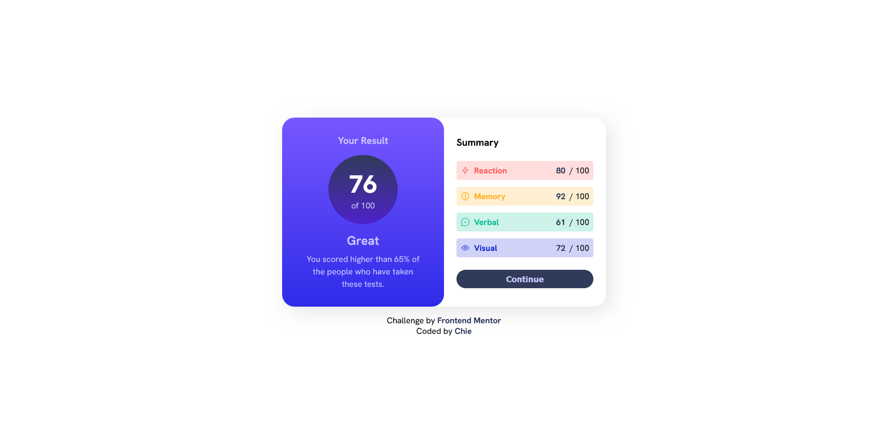
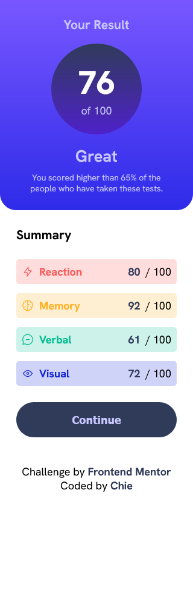

# Frontend Mentor - Results summary component solution

This is a solution to the [Results summary component challenge on Frontend Mentor](https://www.frontendmentor.io/challenges/results-summary-component-CE_K6s0maV). Frontend Mentor challenges help you improve your coding skills by building realistic projects. 

## Table of contents

- [Overview](#overview)
  - [The challenge](#the-challenge)
  - [Screenshot](#screenshot)
  - [Links](#links)
- [My process](#my-process)
  - [Built with](#built-with)
  - [What I learned](#what-i-learned)
  - [Useful resources](#useful-resources)
- [Author](#author)

## Overview

### The challenge

Users should be able to:
- View the optimal layout for the interface depending on their device's screen size
- See hover and focus states for all interactive elements on the page
- **Bonus**: Use the local JSON data to dynamically populate the content

### Screenshot

### Links

- Solution URL: [FE-Results-summary-repository](https://github.com/cos-0000/results-summary)
- Live Site URL: [FE-Results-summary-site](https://your-live-site-url.com)

### Built with

- Semantic HTML5 markup
- CSS custom properties
- Flexbox
- Mobile-first workflow

### What I learned
- I learned more usage and functionality of the Flexbox. This project also helped me on how to use CSS pseudo selectors. I was also able to use JavaScript to manipulate the DOM and populate some HTML elements such as the li element.

## Author

- Website - [Chie](https://github.com/cos-0000)
- Frontend Mentor - [cos-0000](https://www.frontendmentor.io/profile/cos-0000)

